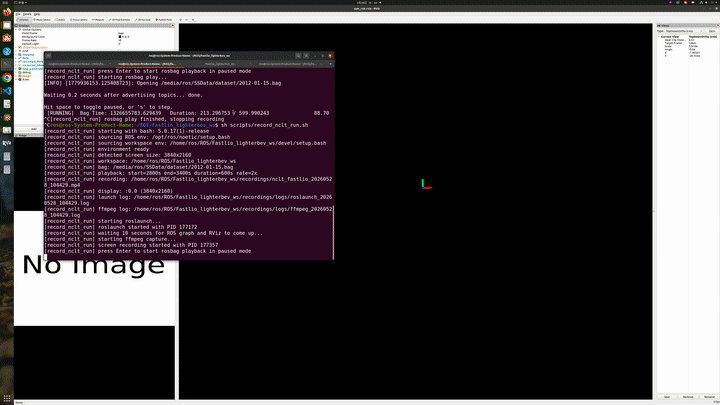

# Fastlio LighterBEV

This repository is a complete LiDAR SLAM system that combines:

- `LighterBEV: LiDAR Global Localization Meets Online Learning`
- `FAST-LIO2: Fast Direct LiDAR-Inertial Odometry`

The system uses FAST-LIO2 as the LiDAR-inertial odometry frontend and integrates LighterBEV-based loop detection and global localization into a ROS1 catkin workspace. The current implementation is built around the `fast_lio_sam_sc_qn` package, with Nano-GICP refinement for loop alignment.

## Features

- Complete LiDAR SLAM pipeline with odometry, loop detection, and pose graph optimization.
- FAST-LIO2 frontend for fast and accurate LiDAR-inertial odometry.
- LighterBEV-based place recognition for long-range loop detection and global localization.
- Nano-GICP refinement for geometric verification and pose correction.
- ROS1 catkin workspace with launch files for multiple LiDAR and dataset settings.
- Included LighterBEV model weight at `src/third_party/LighterBEV/models/tool/pca_kitti_best.pt`.

## Demo



## Installation

### 1. System requirements

- Ubuntu 20.04
- ROS Noetic
- CUDA
- libtorch
- PCL
- Eigen3
- OpenCV
- GTSAM
- Boost
- OpenMP

Example Ubuntu packages:

```bash
sudo apt update
sudo apt install -y \
  build-essential cmake git \
  libeigen3-dev libboost-all-dev \
  libopencv-dev libpcl-dev \
  ros-noetic-cv-bridge ros-noetic-image-transport \
  ros-noetic-pcl-ros ros-noetic-pcl-conversions \
  ros-noetic-tf ros-noetic-tf-conversions \
  ros-noetic-nav-msgs ros-noetic-sensor-msgs \
  ros-noetic-geometry-msgs ros-noetic-visualization-msgs \
  ros-noetic-rosbag ros-noetic-message-filters
```

`GTSAM` is also required. If it is not already available on your machine, install it first before building this workspace.

### 2. CUDA and libtorch

For CUDA and libtorch installation, you can follow the setup notes from:

- <https://github.com/HxCa1/BEV-LIO-LC#14-cuda--libtorch>

After installation, make sure `Torch_DIR` points to the directory containing `TorchConfig.cmake`, for example:

```bash
export Torch_DIR=/path/to/libtorch/share/cmake/Torch
```

### 3. ROS dependencies

Make sure the following ROS-related dependencies are available in your environment:

- `roscpp`
- `roslib`
- `rosbag`
- `std_msgs`
- `geometry_msgs`
- `nav_msgs`
- `sensor_msgs`
- `visualization_msgs`
- `tf`
- `tf_conversions`
- `pcl_ros`
- `pcl_conversions`
- `message_filters`
- `cv_bridge`
- `image_transport`

This repository also contains vendored third-party packages under `src/third_party/`, including `FAST_LIO`, `nano_gicp`, and `livox_ros_driver`.

## Download

```bash
git clone git@github.com:lbhwyy/Fastlio_Lighterbev.git
cd Fastlio_Lighterbev
```

If you prefer HTTPS:

```bash
git clone https://github.com/lbhwyy/Fastlio_Lighterbev.git
cd Fastlio_Lighterbev
```

## Build

```bash
source /opt/ros/noetic/setup.bash
cd /path/to/Fastlio_Lighterbev
catkin_make -DTorch_DIR="${Torch_DIR}"
source devel/setup.bash
```

If `Torch_DIR` is not exported in advance, you can also pass it explicitly:

```bash
catkin_make -DTorch_DIR=/path/to/libtorch/share/cmake/Torch
```

## Run

Launch the integrated SLAM system:

```bash
source /opt/ros/noetic/setup.bash
source devel/setup.bash
roslaunch fast_lio_sam_sc_qn run.launch lidar:=nclt
```

Common launch arguments:

- `lidar`: selects the frontend launch file, such as `nclt`, `ouster`, `livox`, `kitti`, or `mulran`
- `rviz`: whether to launch RViz
- `sam_downsample`: whether to downsample point clouds before LighterBEV preprocessing
- `downsample_voxel_size`: voxel size used when downsampling is enabled

For the provided recording helper:

```bash
export BAG_PATH=/path/to/your.bag
./scripts/record_nclt_run.sh
```

## Repository Structure

- `src/fast_lio_sam_sc_qn`: main integration package
- `src/third_party/FAST_LIO`: FAST-LIO frontend
- `src/third_party/LighterBEV`: LighterBEV inference code and model weight
- `src/third_party/nano_gicp`: Nano-GICP registration backend
- `src/third_party/livox_ros_driver`: Livox ROS driver
- `src/third_party/fastlio_config_launch`: dataset-specific launch and YAML files

## Citation

If you find this repository useful, please cite:

Liu, Binhong, Tao Yang, Haoji Cao, Shuqi Fu, Yangwang Fang, and Zhi Yan. "LighterBEV: LiDAR Global Localization Meets Online Learning." IEEE Robotics and Automation Letters 11, no. 2 (2026): 1170-1177. https://doi.org/10.1109/LRA.2025.3641146

## Acknowledgements

This repository benefits from the following open-source projects:

- <https://github.com/engcang/FAST-LIO-SAM-SC-QN>
- <https://github.com/hku-mars/FAST_LIO>

## License

The repository-level license notice is provided in [LICENSE](LICENSE).
